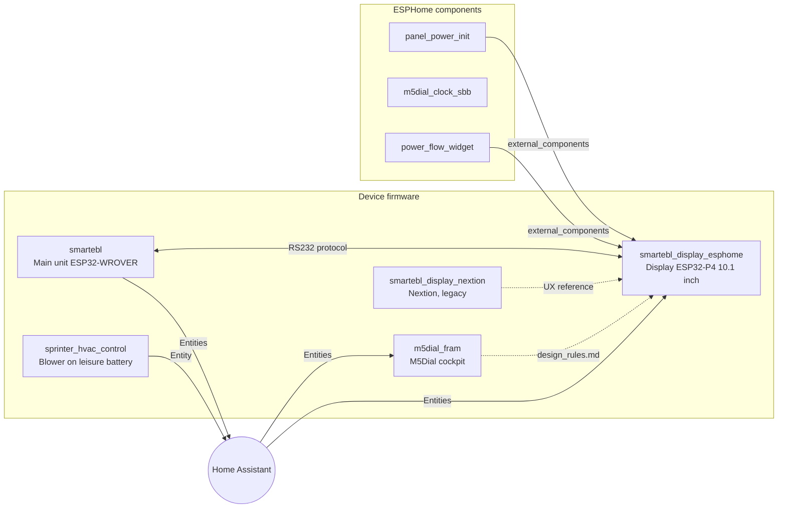

# CzarofAK

ESPHome firmware and components for the motorhome **FRAM** (Frankia Neo GD on a Mercedes Sprinter).
Every device integrates with Home Assistant, but is built so its core functions keep working without a network.

---

## Overview



Solid = technical dependency, dashed = documentation / design reference.

---

## Device firmware

| Repo | Hardware | Purpose | Status |
|---|---|---|---|
| [smartebl](https://github.com/CzarofAK/smartebl) | ESP32-WROVER (SmartEBL board) | Electroblock: fuses, tanks, relays, Truma LIN | active |
| [smartebl_display_esphome](https://github.com/CzarofAK/smartebl_display_esphome) | Waveshare ESP32-P4 + 10.1" DSI | Main display, LVGL touch UI | active |
| [m5dial_fram](https://github.com/CzarofAK/m5dial_fram) | M5Stack Dial | Cockpit controls, pages as packages | active |
| [sprinter_hvac_control](https://github.com/CzarofAK/sprinter_hvac_control) | ESP32 Relay 30A X2 + Cytron MD30C | OEM blower on leisure battery, terminal 15R interlock | active |
| [smartebl_display_nextion](https://github.com/CzarofAK/smartebl_display_nextion) | ESP32 + Nextion 7" | Previous-generation display, replaced by smartebl_display_esphome | legacy, archived |

## ESPHome components

Pulled in via `external_components:`. Production devices always pin a tag, never `main`.

| Repo | Component | Purpose | Used by | Status |
|---|---|---|---|---|
| [panel_power_init](https://github.com/CzarofAK/panel_power_init) | `panel_power_init` | Wakes the panel PMIC (I2C 0x45) before `mipi_dsi` setup | smartebl_display_esphome | in production |
| [m5dial_clock_sbb](https://github.com/CzarofAK/m5dial_clock_sbb) | `sbb_clock` | Swiss railway clock as an LVGL widget | – | available |
| [power_flow_widget](https://github.com/CzarofAK/power_flow_widget) | `power_flow_box` | Victron-style power-flow box | smartebl_display_esphome | in production |

```yaml
external_components:
  - source:
      type: git
      url: https://github.com/CzarofAK/panel_power_init
      ref: v1.0.0        # a tag, not main
    components: [panel_power_init]
```

---

## Interfaces

Git cannot see these dependencies. Changing one means updating every consumer.

### Direct link

| Interface | Provider | Consumer | Specification |
|---|---|---|---|
| RS232 line protocol (telemetry + commands) | smartebl | smartebl_display_esphome | [`docs/protocol.md`](https://github.com/CzarofAK/smartebl_display_esphome/blob/main/docs/protocol.md) |

### Via Home Assistant (entity IDs)

| Function | Provider | Consumers |
|---|---|---|
| HVAC blower (battery mode) | sprinter_hvac_control | m5dial_fram, smartebl_display_esphome |
| Fanboard | – | m5dial_fram, smartebl_display_esphome |
| Truma heating / boiler | WomoLIN controller (MQTT) | m5dial_fram, smartebl_display_esphome |
| Victron (SmartShunt, MultiPlus, MPPT, GX) | Victron integration | m5dial_fram, smartebl_display_esphome |
| Gas level A/I | HA sensors | m5dial_fram, smartebl_display_esphome |
| Diesel level | Vehicle integration | smartebl_display_esphome |
| Tanks, fuses, switching groups | smartebl | Home Assistant, (smartebl_display_esphome via RS232) |

### Shared conventions

| What | Source | Used in |
|---|---|---|
| Design language (colors, thresholds, naming `page_`/`lbl_`/`btn_`/`s_`) | [`m5dial_fram/design_rules.md`](https://github.com/CzarofAK/m5dial_fram/blob/main/design_rules.md) | m5dial_fram, smartebl_display_esphome |
| `.basics.yaml` (Wi-Fi, API, OTA, logger, time) | local, not in any repo | all devices |

---

## Conventions for all repos

- `secrets.yaml` and `.basics.yaml` are never committed; every device repo ships an `*.example` template.
- Before every flash: `esphome config <device>.yaml`.
- Component repos are tagged (`vMAJOR.MINOR.PATCH`); devices reference tags.
- Topics: `fram` and `esphome` on every repo; plus `esphome-component` or `smartebl` where applicable.
