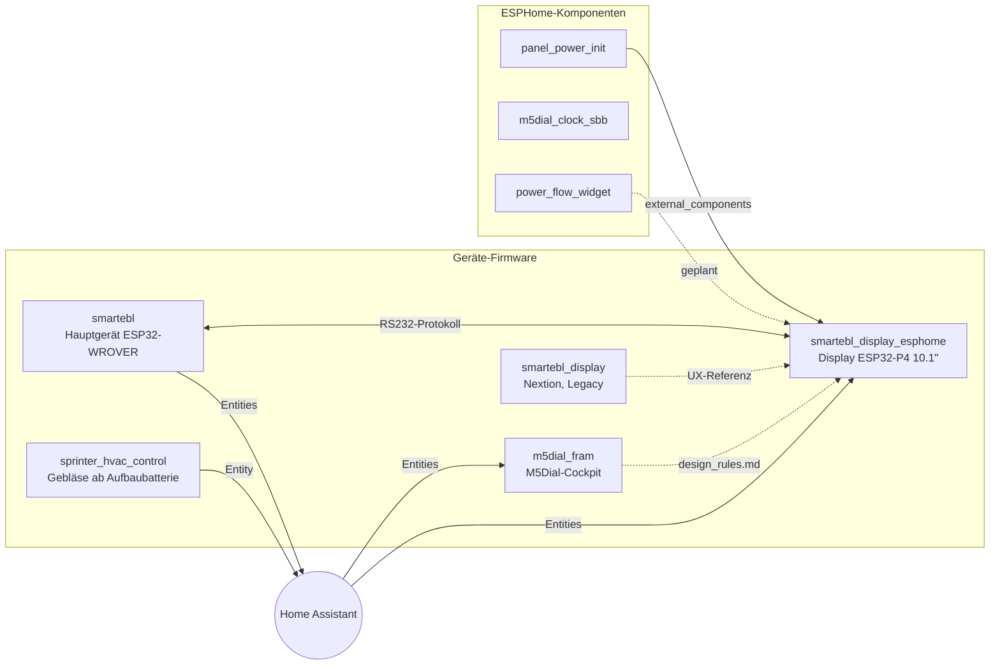

# CzarofAK

ESPHome-Firmware und Komponenten für das Wohnmobil **FRAM** (Frankia Neo GD auf Mercedes Sprinter).
Alle Geräte hängen an Home Assistant, sind aber so gebaut, dass die Kernfunktionen auch ohne Netzwerk laufen.

---

## Übersicht



Durchgezogen = technische Abhängigkeit, gestrichelt = Dokumentations-/Designreferenz.

---

## Geräte-Firmware

| Repo | Hardware | Zweck | Status |
|---|---|---|---|
| [smartebl](https://github.com/CzarofAK/smartebl) | ESP32-WROVER (SmartEBL-Platine) | Elektroblock: Sicherungen, Tanks, Relais, Truma LIN | aktiv |
| [smartebl_display_esphome](https://github.com/CzarofAK/smartebl_display_esphome) | Waveshare ESP32-P4 + 10.1" DSI | Hauptdisplay, LVGL-Touch-UI | aktiv |
| [m5dial_fram](https://github.com/CzarofAK/m5dial_fram) | M5Stack Dial | Cockpit-Bedienung, Seiten als Packages | aktiv |
| [sprinter_hvac_control](https://github.com/CzarofAK/sprinter_hvac_control) | ESP32 Relay 30A X2 + Cytron MD30C | Serien-Gebläse ab Aufbaubatterie, 15R-Interlock | aktiv |
| [smartebl_display](https://github.com/CzarofAK/smartebl_display) | ESP32 + Nextion 7" | Vorgänger-Display | Legacy, archiviert |

## ESPHome-Komponenten

Einbindung über `external_components:`. Für produktive Geräte immer auf einen Tag pinnen, nicht auf `main`.

| Repo | Komponente | Zweck | Genutzt von | Status |
|---|---|---|---|---|
| [panel_power_init](https://github.com/CzarofAK/panel_power_init) | `panel_power_init` | Weckt die Panel-PMIC (I2C 0x45) vor `mipi_dsi`-Setup | smartebl_display_esphome | produktiv |
| [m5dial_clock_sbb](https://github.com/CzarofAK/m5dial_clock_sbb) | `sbb_clock` | SBB-Bahnhofsuhr als LVGL-Widget | – | verfügbar |
| [power_flow_widget](https://github.com/CzarofAK/power_flow_widget) | `power_flow_box` | Victron-Style Power-Flow-Box | – (Migration geplant) | v0.1, ungetestet |

```yaml
external_components:
  - source:
      type: git
      url: https://github.com/CzarofAK/panel_power_init
      ref: v1.0.0        # Tag, nicht main
    components: [panel_power_init]
```

---

## Schnittstellen

Diese Abhängigkeiten sieht Git nicht. Wer hier etwas ändert, muss alle Verbraucher mitziehen.

### Direktverbindung

| Schnittstelle | Anbieter | Verbraucher | Spezifikation |
|---|---|---|---|
| RS232-Zeilenprotokoll (Telemetrie + Befehle) | smartebl | smartebl_display_esphome | [`docs/protocol.md`](https://github.com/CzarofAK/smartebl_display_esphome/blob/main/docs/protocol.md) |

### Über Home Assistant (Entity-IDs)

| Funktion | Anbieter | Verbraucher |
|---|---|---|
| HVAC-Gebläse (Battery-Mode) | sprinter_hvac_control | m5dial_fram, smartebl_display_esphome |
| Fanboard | – | m5dial_fram, smartebl_display_esphome |
| Truma Heizung/Boiler | WomoLIN Controller (MQTT) | m5dial_fram, smartebl_display_esphome |
| Victron (SmartShunt, MultiPlus, MPPT, GX) | Victron-Integration | m5dial_fram, smartebl_display_esphome |
| Gasstand A/I | HA-Sensoren | m5dial_fram, smartebl_display_esphome |
| Diesel-Füllstand | Fahrzeug-Integration | smartebl_display_esphome |
| Tanks, Sicherungen, Schaltgruppen | smartebl | Home Assistant, (smartebl_display_esphome via RS232) |

### Gemeinsame Konventionen

| Was | Quelle | Verwendet in |
|---|---|---|
| Designsprache (Farben, Schwellwerte, Naming `page_`/`lbl_`/`btn_`/`s_`) | [`m5dial_fram/design_rules.md`](https://github.com/CzarofAK/m5dial_fram/blob/main/design_rules.md) | m5dial_fram, smartebl_display_esphome |
| `.basics.yaml` (WiFi, API, OTA, Logger, Zeit) | lokal, nicht im Repo | alle Geräte |

---

## Konventionen für alle Repos

- `secrets.yaml` und `.basics.yaml` werden nie committet; jedes Geräte-Repo liefert eine `*.example`-Vorlage.
- Vor jedem Flash: `esphome config <device>.yaml`.
- Komponenten-Repos bekommen Tags (`vMAJOR.MINOR.PATCH`); Geräte referenzieren Tags.
- Topics: `fram`, `esphome` für alle; zusätzlich `esphome-component` bzw. `smartebl`.
